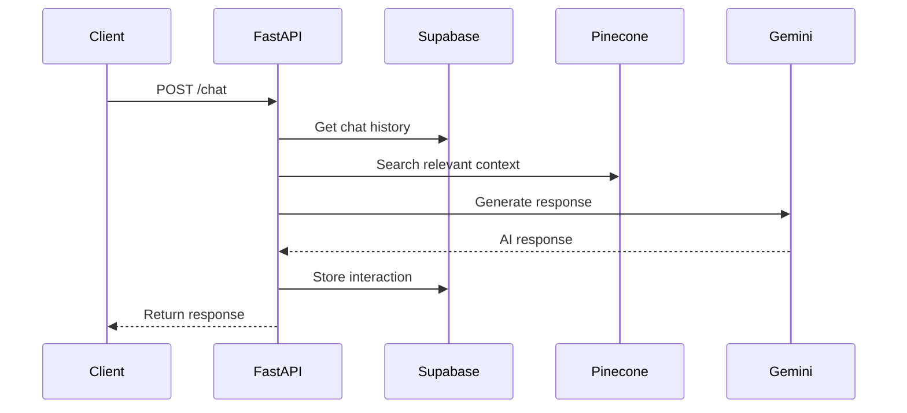

# 麵屋心 Chatbot Backend

A sophisticated chatbot backend service built with FastAPI, designed specifically for restaurant assistance using Retrieval-Augmented Generation (RAG) with Pinecone vector database and Google's Gemini AI.

## 🏗️ Architecture

```
┌─────────────────┐    ┌─────────────────┐    ┌─────────────────┐
│   Client App    │───▶│   FastAPI       │───▶│   Gemini API    │
│                 │    │   Server        │    │                 │
└─────────────────┘    └─────────────────┘    └─────────────────┘
                              │
                              ▼
                    ┌─────────────────┐    ┌─────────────────┐
                    │   Supabase      │    │   Pinecone      │
                    │   (Chat History)│    │   (Vector DB)   │
                    └─────────────────┘    └─────────────────┘
```

## 🚀 Features

- **RESTful API** with FastAPI framework
- **Multi-language Support** (English, Chinese, Japanese, Korean)
- **Conversation History** stored in Supabase PostgreSQL
- **Vector Search** using Pinecone for relevant context retrieval
- **AI Responses** powered by Google Gemini API
- **Docker Support** for easy deployment
- **Health Checks** and monitoring endpoints
- **CORS Support** for web applications

## 📋 Prerequisites

- Python 3.10 or higher
- Docker and Docker Compose (optional)
- Supabase account and project
- Google Gemini API key
- Pinecone account and API key

## 🛠️ Quick Start

### Option 1: Automated Setup

```bash
git clone <your-repo>
cd 麵屋心_chatbot
./setup.sh
```

### Option 2: Manual Setup

1. **Clone and setup environment:**
```bash
git clone <your-repo>
cd 麵屋心_chatbot
python3 -m venv venv
source venv/bin/activate
pip install -r requirements.txt
```

2. **Configure environment variables:**
```bash
cp .env.example .env
# Edit .env with your API keys
```

3. **Set up Supabase database:**
   - Go to your Supabase project's SQL editor
   - Run the commands in `database_setup.sql`

4. **Start the server:**
```bash
python server.py
```

### Option 3: Docker

```bash
# Copy and configure environment
cp .env.example .env
# Edit .env with your API keys

# Run with Docker Compose
docker-compose up --build
```

## ⚙️ Configuration

Create a `.env` file with the following variables:

```env
# Supabase Configuration
SUPABASE_URL=your_supabase_project_url
SUPABASE_KEY=your_supabase_anon_key

# Google Gemini API
GEMINI_API_KEY=your_gemini_api_key

# Pinecone Vector Database
PINECONE_API_KEY=your_pinecone_api_key
PINECONE_ENVIRONMENT=your_pinecone_environment
PINECONE_INDEX_NAME=restaurant-knowledge

# Application Settings
DEBUG=False
```

## 📡 API Endpoints

### Main Chat Endpoint

**POST** `/chat`

Request:
```json
{
  "Language": "en",
  "Query": "What's on the menu today?",
  "Session_ID": "unique-session-id"
}
```

Response:
```json
{
  "response": "Our menu today features...",
  "session_id": "unique-session-id",
  "timestamp": "2025-05-29T10:30:00Z"
}
```

### Additional Endpoints

- **GET** `/` - Health check
- **GET** `/health` - Detailed health status
- **GET** `/sessions/{session_id}/history` - Get conversation history
- **DELETE** `/sessions/{session_id}` - Clear session history

## 🗄️ Database Schema

### chat_history Table

| Column      | Type        | Description                        |
|-------------|-------------|------------------------------------|
| id          | UUID        | Primary key                        |
| session_id  | TEXT        | Groups messages per session        |
| query       | TEXT        | User's message                     |
| response    | TEXT        | Chatbot's reply                    |
| language    | TEXT        | Language of interaction            |
| timestamp   | TIMESTAMPTZ | When the entry was created         |

## 🔄 Flow Diagram



## 🧪 Testing

### Test the API manually:

```bash
curl -X POST "http://localhost:8000/chat" \
     -H "Content-Type: application/json" \
     -d '{
       "Language": "en",
       "Query": "What are your opening hours?",
       "Session_ID": "test-session-123"
     }'
```

### Health Check:

```bash
curl http://localhost:8000/health
```

## 📚 Development

### Project Structure

```
麵屋心_chatbot/
├── server.py              # FastAPI application
├── ai_init.py             # Gemini AI and Supabase integration
├── vector_db.py           # Pinecone vector database operations
├── requirements.txt       # Python dependencies
├── Dockerfile            # Docker configuration
├── docker-compose.yml    # Docker Compose setup
├── database_setup.sql    # Supabase database schema
├── setup.sh             # Automated setup script
├── .env.example         # Environment variables template
└── README.md           # This file
```

### Adding New Features

1. **Custom Knowledge Base**: Add documents to Pinecone using the `vector_db.py` module
2. **Language Support**: Extend language prompts in `ai_init.py`
3. **Custom Endpoints**: Add new routes in `server.py`

## 🚨 Troubleshooting

### Common Issues

1. **Import Errors**: Ensure all dependencies are installed:
   ```bash
   pip install -r requirements.txt
   ```

2. **Database Connection**: Verify Supabase credentials in `.env`

3. **Pinecone Issues**: Check API key and ensure index exists

4. **Gemini API**: Verify API key and quota limits

### Logs

The application logs important information. Check logs for debugging:
```bash
# If running with Docker
docker-compose logs -f chatbot-api
```

## 🔒 Security

- Environment variables for sensitive data
- CORS middleware configured
- Row Level Security enabled on Supabase
- Non-root user in Docker container

## 📈 Production Deployment

### Recommended Steps:

1. **Environment Setup**: Use production-grade environment variables
2. **Database**: Configure proper RLS policies in Supabase
3. **Monitoring**: Add logging and monitoring solutions
4. **Load Balancing**: Use reverse proxy (nginx) for multiple instances
5. **SSL**: Configure HTTPS certificates

### Scaling Considerations:

- Use Redis for session management at scale
- Implement rate limiting
- Consider using a proper embedding model for Pinecone
- Add database connection pooling

## 🤝 Contributing

1. Fork the repository
2. Create a feature branch
3. Make your changes
4. Add tests if applicable
5. Submit a pull request

## 📄 License

This project is licensed under the MIT License.

## 🆘 Support

For support and questions:
- Create an issue in the repository
- Check the troubleshooting section
- Review the API documentation at `/docs` when the server is running

---

Built with ❤️ for 麵屋心 Restaurant
